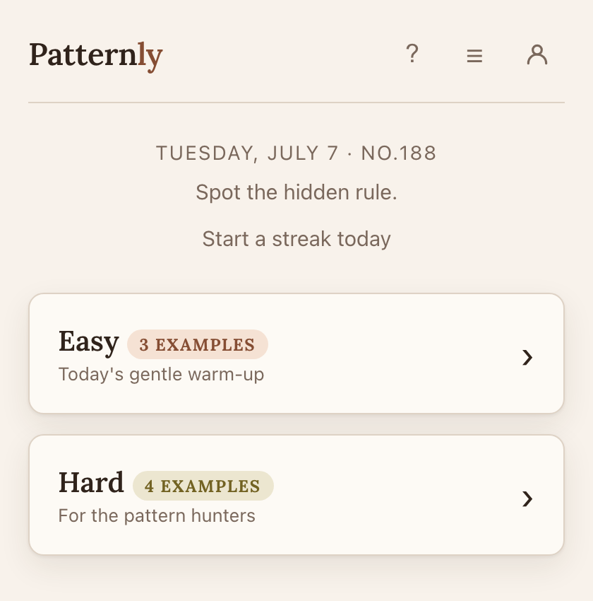

# Patternly

<p align="center">
  
</p>

A daily number-pattern puzzle: study a few examples, figure out the hidden
rule, and predict what comes next. Three lives, no categories, no hints.

**[Play now →](https://puengcurry05.github.io/Patternly/)**

## Features

- **Daily puzzles** — a fresh Easy + Hard pair every day, three lives each
- **Community puzzles** — anyone can submit a puzzle; admin-reviewed before it goes live
- **Server-side answer validation** — the answer never reaches the browser until a game ends
- **Ambiguity checker** — every puzzle is tested against ~2,600 candidate rules before publishing, so there's always exactly one valid answer
- **Static frontend + Supabase** — no custom backend process to run or host

## Tech stack

```
public/     Static site (HTML/CSS/JS) — deploy to any CDN or GitHub Pages
Supabase    Postgres + auto-generated REST API — all game logic lives in SQL functions
```

The browser only ever calls four database RPCs over Supabase's REST API — it
never reads a table directly, which is what keeps today's answer hidden until
the game is over. See [docs/architecture.md](docs/architecture.md) for the
full design.

## Run locally

```bash
python3 -m http.server 4310 --directory public   # http://localhost:4310
```

The app talks to hosted Supabase, so behavior is identical locally or deployed.

## Docs

- [docs/architecture.md](docs/architecture.md) — answer secrecy, Supabase config, database schema
- [docs/community.md](docs/community.md) — browsing, submitting, and reviewing community puzzles
- [docs/admin.md](docs/admin.md) — the admin panel and admin-key handling
- [docs/auth.md](docs/auth.md) — optional email/password login and how it interacts with guest play
- [docs/security.md](docs/security.md) — security notes and known limitations
- [docs/deploy.md](docs/deploy.md) — deployment notes
